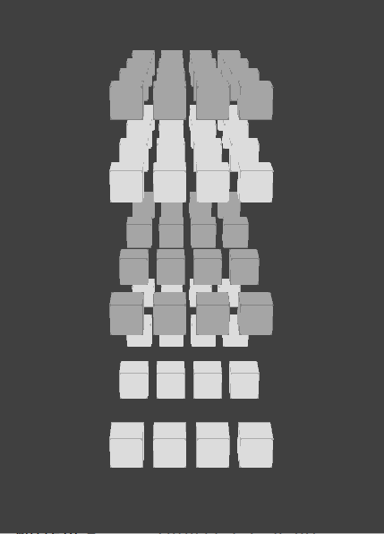
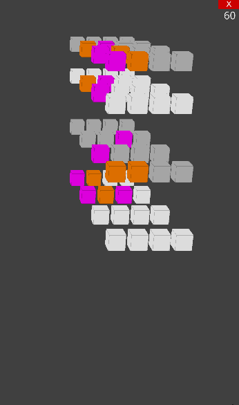

# 3D 4x4x4 Tic Tac Toe
Controllable 3D grid that acts as a multi-dimensional game of tictactoe. Complete a line with 4 markers of the same color (horizontally, vertically or diagonally) to win.




Nice TODO
-----
* FIX Minimax (maybe substitute it?)
* Better 3D Interaction

Usage
-----
```
 pip3 install ursina numpy
 # then...
 ./play.py
```
Implementation
-----

There is a simple minimax with alpha-beta pruning that scans the 4x4x4 grid.
